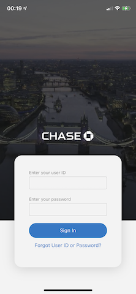
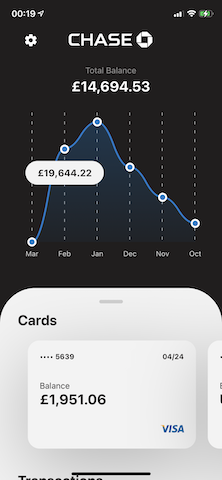
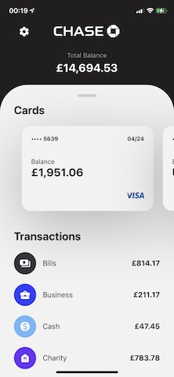
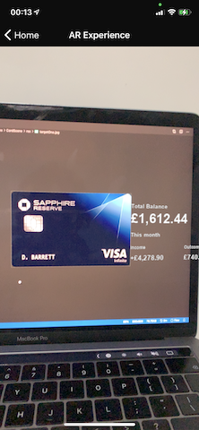
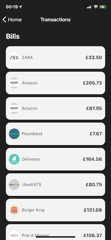
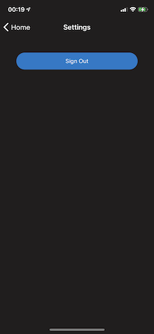

<!-- markdownlint-disable MD041-->

![[License]https://opensource.org/licenses/MIT](https://img.shields.io/npm/l/make-coverage-badge.svg) [](http://commitizen.github.io/cz-cli/)  [](https://coveralls.io/github/razvangeangu/chase?branch=develop)

# chase

A demo application demonstrating a react-native application that resembles Chase mobile banking application.

## Get Started

If you want to setup this repository locally follow the next commands:

```sh
gh repo clone razvangeangu/chase
cd chase
yarn
yarn start
```

Once the app is installed you may run it on a device or emulator (e.g. `yarn start ios`).

## Features

- Localization with translations in 2 languages (English and Romanian)
- Stack navigation with conditional authentication context
- Augmented Reality Card information
- Login, Home, Cards, Settings and Transactions pages
- Theming with styled components (light and dark) based on system preferences
- Tests using jest and @testing-library
- Charts for monthly spending overview
- Linting eslint, stylelint, prettier and commitlint powered by commitizen
- TypeScript
- GitHub CI pipeline for building and checking

## Screenshots







